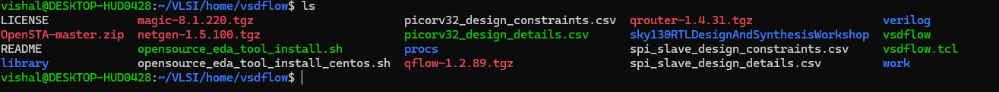
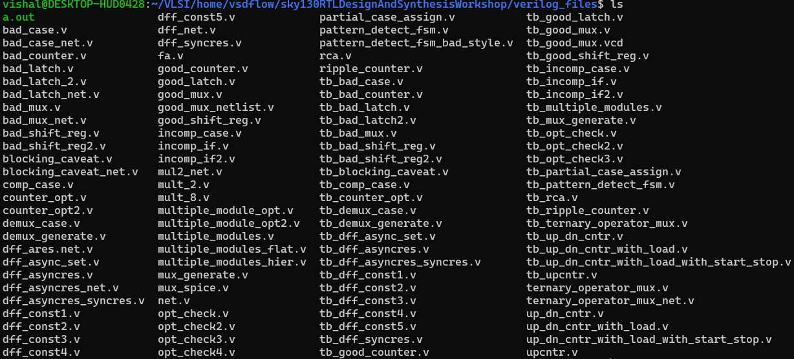
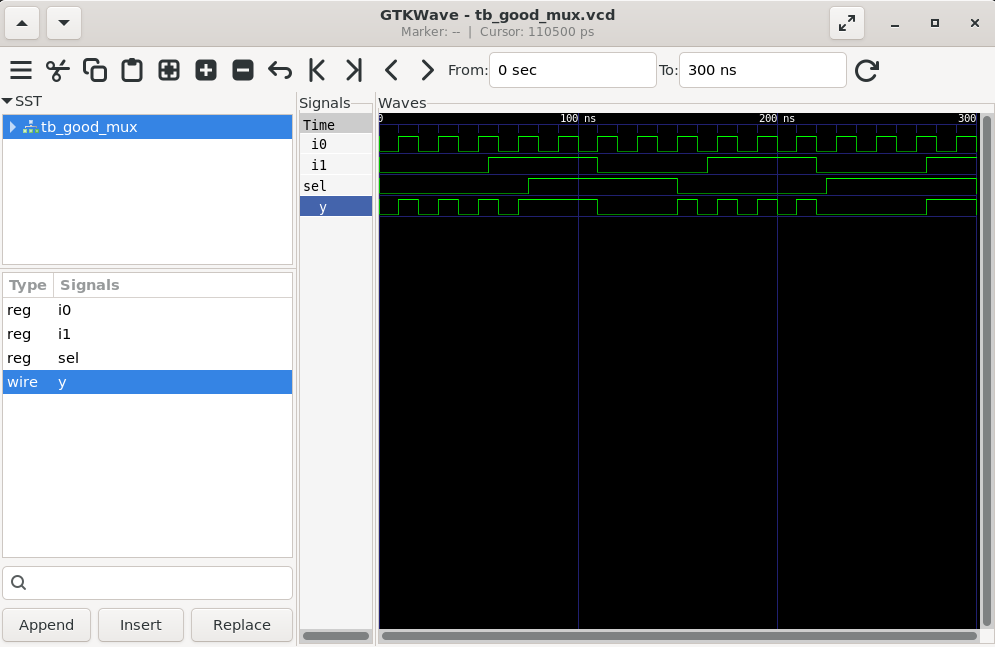

# sfal-vsd-summary

<details>
	<summary>Day 0 - Tools Installation </summary>
	
# Day 0 - Tools Installation
## Yosys
A framework for Verilog RTL synthesis.
```
# Update package lists
sudo apt-get update

# Clone the Yosys repository
git clone [https://github.com/YosysHQ/yosys.git](https://github.com/YosysHQ/yosys.git)
cd yosys

# Install dependencies
sudo apt-get install build-essential clang bison flex \
	libreadline-dev gawk tcl-dev libffi-dev git \
	graphviz xdot pkg-config python3 libboost-system-dev \
	libboost-python-dev libboost-filesystem-dev zlib1g-dev

# Build and install
make config-gcc
make
sudo make install
```
## Icarus Verilog (iverilog)
A Verilog simulation and synthesis tool.
```
sudo apt-get update
sudo apt-get install iverilog
```
## GTKWave
A fully featured GTK+ based waveform viewer.
```
sudo apt-get update
sudo apt-get install gtkwave
```
## ngspice
A mixed-level/mixed-signal circuit simulator.
```
# First, download the tarball from [https://sourceforge.net/projects/ngspice/files/](https://sourceforge.net/projects/ngspice/files/)
# Then, run the following commands, replacing 'ngspice-XX' with the correct version number.
tar -zxvf ngspice-XX.tar.gz
cd ngspice-XX
mkdir release
cd release
../configure --with-x --with-readline=yes --disable-debug
make
sudo make install
```
## Magic
A VLSI layout tool.
```
# Install all dependencies at once
sudo apt-get install m4 tcsh csh libx11-dev tcl-dev tk-dev \
    libcairo2-dev mesa-common-dev libglu1-mesa-dev libncurses-dev

# Clone the repository
git clone [https://github.com/RTimothyEdwards/magic.git](https://github.com/RTimothyEdwards/magic.git)
cd magic

# Build and install
./configure
make
sudo make install
```
## OpenLANE
An automated RTL to GDSII flow that runs in a Docker environment.
```
1. Install Dependencies
sudo apt-get update
sudo apt-get upgrade
sudo apt install -y build-essential python3 python3-venv python3-pip make git
```
## 2. Install Docker
```
# Add Docker's official GPG key and set up the repository
sudo apt install apt-transport-https ca-certificates curl software-properties-common
curl -fsSL [https://download.docker.com/linux/ubuntu/gpg](https://download.docker.com/linux/ubuntu/gpg) | sudo gpg --dearmor -o /usr/share/keyrings/docker-archive-keyring.gpg
echo "deb [arch=amd64 signed-by=/usr/share/keyrings/docker-archive-keyring.gpg] [https://download.docker.com/linux/ubuntu](https://download.docker.com/linux/ubuntu) $(lsb_release -cs) stable" | sudo tee /etc/apt/sources.list.d/docker.list > /dev/null

# Install Docker Engine
sudo apt update
sudo apt install docker-ce docker-ce-cli containerd.io
```
## 3. Manage Docker Permissions
```
# Add your user to the 'docker' group to run commands without sudo
sudo groupadd docker
sudo usermod -aG docker $USER

# IMPORTANT: YOU MUST REBOOT YOUR SYSTEM NOW FOR THIS TO TAKE EFFECT
sudo reboot

# After rebooting, verify by running: docker run hello-world
```
## 4. Install OpenLANE
```
# Navigate to your home directory and clone the repository
cd $HOME
git clone [https://github.com/The-OpenROAD-Project/OpenLane.git](https://github.com/The-OpenROAD-Project/OpenLane.git)

# Go into the directory and build the environment
cd OpenLane
make

# Run the test set to ensure everything works
make test
```


  
# Day 0 - The Digital Chip Design and Verification Flow

This document outlines the standard process for taking an application from a high-level specification to a physical, manufactured microchip. The core principle is to create and verify the design at different levels of abstraction, ensuring the output remains consistent at every stage.

The ultimate goal is to ensure the final silicon chip's output (**O4**) matches the outputs from all previous stages of design and simulation (**O3**, **O2**, and **O1**).

`O4 == O3 == O2 == O1`


---

##  Stage 1: High-Level Modeling (Output O1)

Before designing any hardware, we first model the chip's intended application in a high-level language like C or C++. This model serves as a "golden reference" to ensure the logic is correct and meets the specification.

* **Goal:** Create a functional C model of the application's specification.
* **Process:**
    1.  The application logic is written in C.
    2.  A testbench, also in C, is created to provide inputs to the model and check its output.
    3.  The code is compiled using a standard C compiler (like GCC).
* **Verification:** The output from this stage is **O1**. We run the testbench to confirm that **O1** matches the expected result. This validates the core algorithm.

---

##  Stage 2: RTL Design (Output O2)

Once the high-level logic is confirmed, we create a "soft copy" of the hardware using a Hardware Description Language (HDL).

* **Goal:** Describe the hardware's behavior and structure in code.
* **Process:** The hardware design, including the processor and peripherals, is written in an HDL like Verilog or SystemVerilog. This is called the Register-Transfer Level (RTL) design.
* **Verification:** We run the same application from Stage 1 on a simulation of the RTL hardware. The output of this simulation is **O2**. The critical check here is to ensure `O2 == O1`. This proves that our hardware design correctly implements the application's logic.

---

##  Stage 3: Synthesis & SoC Integration (Output O3)

In this stage, the abstract RTL code is converted into a design made of actual logic gates, and all the chip's components are connected.

* **Goal:** Convert the RTL design into a gate-level netlist and integrate all components into a full System on a Chip (SoC).
* **Process:**
    1.  **Synthesis:** The RTL code is fed into a synthesis tool, which converts it into a **Gate Level Netlist**—a description using standard logic gates (AND, OR, etc.).
    2.  **Component Integration:** The synthesized netlist is combined with other essential blocks like **Macros** (reusable blocks like clock dividers) and **Analog IPs** (ADCs, PLLs).
    3.  **SoC Assembly:** All blocks are connected with General Purpose Input/Output (GPIOs) to create the complete SoC design.
* **Verification:** The application is run on a simulation of this final, integrated gate-level design. The output is **O3**. We must verify that `O3 == O2 == O1`.

---

##  Stage 4: Physical Design & Tapeout (GDSII)

This is where the digital design is transformed into a physical layout—a detailed blueprint for manufacturing.

* **Goal:** Create the final manufacturing file (**GDSII**).
* **Process:**
    1.  **Physical Design:** This involves **floorplanning** (arranging major blocks), **placement** (placing logic gates), and **routing** (drawing the metal wires to connect everything).
    2.  **GDSII Generation:** The final layout is saved in a GDSII file format, which is the blueprint sent to the factory (foundry).
    3.  **Final Checks:** The GDSII file undergoes rigorous checks like **DRC** (Design Rule Check) and **LVS** (Layout vs. Schematic).
* **Tapeout:** The process of sending the final, verified GDSII file to the manufacturing plant.

---

##  Stage 5: Chip Validation (Output O4)

After manufacturing, the physical chip is returned from the foundry. This is often called "Tape-in" or "Silicon Bring-up."

* **Goal:** Test the real silicon chip to ensure it works correctly.
* **Process:** The physical chip is placed on a test board, and the original C testbench is used to feed it inputs and measure its outputs.
* **Verification:** The output from the physical chip is **O4**. The final, ultimate verification is confirming that `O4 == O3 == O2 == O1`. If this holds true, the chip is ready for the market.

---

## Illustrative C Code Example (Stage 1)

Here is a simple example demonstrating Stage 1: creating a C model for a Multiply-Accumulate (MAC) application and testing it with a testbench.

### 1. `application_model.h` - The Header File
This file declares the function that our application model provides.
```c
#ifndef APPLICATION_MODEL_H
#define APPLICATION_MODEL_H

// This function represents the core logic of our application
int run_mac_operation(int a, int b, int c);

#endif // APPLICATION_MODEL_H
```
#### 2. `application_model.c` - The C Model
This file contains the actual C implementation of our application, which serves as the golden reference.
```
#include "application_model.h"

// Implementation of the MAC operation
// This is the "specification" or "golden reference" model
int run_mac_operation(int a, int b, int c) {
    int product = a * b;
    int result = product + c;
    return result;
}
```
### 3. `testbench.c` - The Testbench
This file tests our C model. It provides inputs, gets the output (O1), and compares it to a known correct answer.
```
#include <stdio.h>
#include "application_model.h"

int main() {
    // 1. Define test inputs
    int input_a = 10;
    int input_b = 5;
    int input_c = 20;

    // 2. Define the expected "golden" output for these inputs
    // Expected = (10 * 5) + 20 = 70
    int expected_o1 = 70;

    printf("--- C Testbench Running ---\n");
    printf("Inputs: a=%d, b=%d, c=%d\n", input_a, input_b, input_c);
    printf("Expected Output (O1): %d\n", expected_o1);

    // 3. Run the application model to get the actual output
    int actual_o1 = run_mac_operation(input_a, input_b, input_c);
    printf("Actual Output (O1) from C Model: %d\n", actual_o1);

    // 4. Verification Step: Compare actual output with expected output
    if (actual_o1 == expected_o1) {
        printf("VERIFICATION PASSED: actual_o1 == expected_o1\n");
    } else {
        printf("VERIFICATION FAILED: actual_o1 != expected_o1\n");
    }

    return 0;
}
```
### 4. `Makefile` - How to Compile
This file tells the `gcc` compiler how to build the final executable program.
```
# Makefile to compile the testbench and application model

# Compiler
CC = gcc

# Compiler flags
CFLAGS = -Wall -Werror

# Target executable name
TARGET = testbench

# Source files
SOURCES = testbench.c application_model.c

# Default rule to build the target
all: $(TARGET)

$(TARGET): $(SOURCES)
	$(CC) $(CFLAGS) -o $(TARGET) $(SOURCES)

# Rule to clean up generated files
clean:
	rm -f $(TARGET)
```
How to Run This Example
1. Save the four code blocks above into their respective files (`application_model.h`, `application_model.c`, `testbench.c`, `Makefile`).

2. Open a terminal in that directory.

3. Compile the code by running the `make` command:
```
make
```
### 4.Execute the compiled program:
```
./testbench
```
#### 5.You will see the following output, which confirms that the C model passed the test.
```
--- C Testbench Running ---
Inputs: a=10, b=5, c=20
Expected Output (O1): 70
Actual Output (O1) from C Model: 70
VERIFICATION PASSED: actual_o1 == expected_o1
```
</details>

# Week 1 

<details>
	<summary>Day 1 - Introduction to Verilog RTL design and Synthesis </summary>

#  Day 1 - Introduction to Verilog RTL design and Synthesis
This section provides an introduction to Verilog RTL design and synthesis, covering the basics of the open-source simulator iverilog, practical labs using iverilog and gtkwave, an introduction to Yosys and logic synthesis, and hands-on labs with Yosys and Sky130 PDKs.


## Introduction to open-source simulator iverilog

Icarus Verilog is an open-source Verilog simulator that allows for the simulation of digital circuits described in the Verilog Hardware Description Language (HDL). It is a valuable tool for debugging and verifying the functionality of your designs before they are synthesized into hardware. This section will cover the basics of installing and using iverilog to compile and simulate your Verilog code.

### RTL Simulation
RTL (Register Transfer Level) design verification is performed through simulation to ensure the design meets specifications. The simulator monitors input signal changes and re-evaluates outputs whenever changes are detected.

Key Tool: Iverilog - An open-source Verilog simulator used for design verification.

### Design and Testbench
#### Design
* Contains Verilog code that implements the required specifications
* Includes primary inputs and outputs
* Represents the actual hardware functionality
#### Testbench
* Setup for applying stimulus to verify the design
* Acts as a stimulus generator
* Contains logic to drive inputs to the design under test
* Monitors and verifies design outputs
Bidirectional relationship: testbench outputs feed design inputs, design outputs feed back to testbench


## Labs using iverilog and gtkwave

### Lab-1 Introduction to iverilog design test bench 


### Lab-2 Introduction iverilog gtkwave part1 

In these labs, will get hands-on experience with iverilog and the GTKWave waveform viewer. You will learn how to write simple Verilog modules, create testbenches to verify their functionality, and use GTKWave to visualize the simulation results. This will help you understand the behavior of your designs and debug any issues.

Folder structure of the git clone:

* `lib` - will contain sky130 standard cell library
* `my_lib/verilog_models` - will contain standard cell verilog model
* `verilog_files -contains` the lab experiments source files


Example of a design good_mux.v
```
module good_mux (input i0 , input i1 , input sel , output reg y);
always @ (*)
begin
	if(sel)
		y <= i1;
	else 
		y <= i0;
end
endmodule
```

Example of a testbench tb_good_mux.v

```
`timescale 1ns / 1ps
module tb_good_mux;
	// Inputs
	reg i0,i1,sel;
	// Outputs
	wire y;

        // Instantiate the Unit Under Test (UUT)
	good_mux uut (
		.sel(sel),
		.i0(i0),
		.i1(i1),
		.y(y)
	);

	initial begin
	$dumpfile("tb_good_mux.vcd");
	$dumpvars(0,tb_good_mux);
	// Initialize Inputs
	sel = 0;
	i0 = 0;
	i1 = 0;
	#300 $finish;
	end

always #75 sel = ~sel;
always #10 i0 = ~i0;
always #55 i1 = ~i1;
endmodule
```

- For executing any Verilog file into the iverlog simulation 
```
$ iverilog <verilogfile> <testbench>
```
- For Example
```
$ iverilog good_mux.v tb_good_mux.v
```

- Executing this cmd a new file will be created named as a.out in the same folder 



- Now run this a.out file 

```
./a.out 
```

- A new file will be created format of that will be .vcd
- `VCD File` - Value Change Dump File

- Now, we will launch the gtkwave for wave simulation 

```
gtkwave <vcd created in previous step>
```
For example 
```
gtkwave tb_good_mux.vcd
```

On running this cmd a new window will be opened of gtk wave 
1. Simply drag and drop input and output to signals
2. Click on zoom fit button



To view or edit any .v (verilog code) file
```
gvim tb_goodmux_mux.v -o good_mux.v
```


**VCD File:** Value Change Dump file containing signal transitions over time for waveform analysis.

## Logic Synthesis

### Overview
Logic synthesis transforms RTL (behavioral) code into gate-level netlist representation. This process converts high-level Verilog descriptions into actual hardware gates that can be implemented.

**Key Tool:** Yosys - Open-source synthesis tool

### Synthesis Process
1. **Input:** RTL design + Liberty file (.lib)
2. **Process:** Synthesis tool maps RTL to available gates
3. **Output:** Gate-level netlist

### Verification
The synthesized netlist must be functionally equivalent to the original RTL:
- Same testbench can verify both RTL and netlist
- Same primary inputs and outputs
- Identical simulation results (VCD files should match)

## Liberty Files (.lib)

Liberty files contain characterization data for standard cell libraries:

- **Content:** Logical modules (AND, OR, NOT, etc.)
- **Variations:** Multiple drive strengths (slow, medium, fast)
- **Configurations:** Different input counts (2-input, 3-input, 4-input gates)
- **Purpose:** Provides timing, power, and area information for synthesis optimization

## Timing Considerations

### Setup Time Constraint
For proper sequential circuit operation:

T_clk > T_cq_A + T_combi + T_setup_B

Where:
- `T_clk`: Clock period
- `T_cq_A`: Clock-to-Q delay of source flip-flop
- `T_combi`: Combinational logic delay
- `T_setup_B`: Setup time of destination flip-flop

### Maximum Frequency

f_max = 1/T_clk


### Cell Selection Strategy

**Fast Cells:**
- Reduce combinational delays
- Help meet setup time requirements
- Higher power consumption and area

**Slow Cells:**
- Provide necessary delays for hold time requirements
- Prevent race conditions
- Lower power and area

**Optimization Goal:** Balance speed, power, and area requirements by selecting appropriate cell variants.

## Synthesis with Yosys

### Basic Yosys Commands

| Command | Purpose |
|---------|---------|
| `read_verilog` | Load Verilog design files |
| `read_liberty` | Load standard cell library files |
| `write_verilog` | Generate synthesized netlist |

### Synthesis Flow Example

# Read design file
yosys> read_verilog good_mux.v

# Read liberty file
yosys> read_liberty -lib /home/chippy/.volare/volare/sky130/versions/0fe599b2afb6708d281543108caf8310912f54af/sky130B/libs.ref/sky130_fd_sc_hd/lib/sky130_fd_sc_hd__tt_025C_1v80.lib

# Synthesize design (specify top module)
yosys> synth -top good_mux

# Technology mapping using ABC
yosys> abc -liberty /home/chippy/.volare/volare/sky130/versions/0fe599b2afb6708d281543108caf8310912f54af/sky130B/libs.ref/sky130_fd_sc_hd/lib/sky130_fd_sc_hd__tt_025C_1v80.lib

# Display synthesized netlist
yosys> show

# Write netlist file
yosys> write_verilog netlist.v


### Key Points
- The same testbench verifies both RTL and synthesized netlist
- Netlist represents the true gate-level implementation
- ABC command performs technology mapping to standard cells
- The liberty file used is the Sky130 PDK standard cell library at typical corner (tt_025C_1v80)

## Workshop Tools Summary

- **Iverilog:** Simulation and verification
- **GTKWave:** Waveform visualization
- **Yosys:** Logic synthesis
- **Sky130 PDK:** Process design kit with standard cell libraries


</Details>

<Details>
	
<summary> Day 2 - RTL Design and Synthesis Workshop Notes  </summary>

## Table of Contents
- [PVT in Liberty Files](#pvt-in-liberty-files)
- [Cell Variants and Area](#cell-variants-and-area)
- [Hierarchical Synthesis](#hierarchical-synthesis)
- [Flip-Flop Reset Strategies](#flip-flop-reset-strategies)
- [Yosys Flow for Sequential Logic](#yosys-flow-for-sequential-logic)
- [Optimization Techniques](#optimization-techniques)
- [Common Yosys Commands](#common-yosys-commands)

## PVT in Liberty Files

**PVT** stands for **Process, Voltage, and Temperature**. These three factors determine how silicon chips behave in real-world conditions:

- **Process**: Variations in manufacturing (like doping, lithography) cause each chip to behave slightly differently
- **Voltage**: Chips may be run at different supply voltages, affecting speed and power
- **Temperature**: Performance and leakage change with temperature

A typical liberty file name, like `sky130_fd_sc_hd__tt_025C_1v80.lib`, encodes these conditions:
- `tt` = typical process
- `025C` = 25°C
- `1v80` = 1.80V supply

This file contains detailed parameters for each cell (like AND, OR, etc.) under these conditions: leakage power, current, rise/fall times, slew rates, and more. Each cell may have several variants (e.g., `and1`, `and2`) with different drive strengths and areas. Larger area usually means higher speed and more leakage.

## Cell Variants and Area

- **Multiple cells** for the same logic function (e.g., `and1`, `and2`) differ mainly in transistor sizing
- **Larger cells**: Faster, but use more area and power
- **Smaller cells**: Slower, but save area and power

## Hierarchical Synthesis

**Stacking PMOS** transistors increases resistance and slows down the circuit. Synthesis tools prefer using NAND gates (which have parallel PMOS) over NOR gates (which have stacked PMOS) for efficiency.

By default, `write_verilog` in Yosys preserves the module hierarchy. To flatten the design into a single module, use:


yosys> flatten


**Submodule-level synthesis** is useful when you have multiple instances of the same module or want to break down a large design for easier synthesis and optimization:


yosys> synth -top <sub_module_name>


## Flip-Flop Reset Strategies

- **Asynchronous reset**: Flip-flop resets immediately when the reset signal changes, regardless of the clock
- **Synchronous reset**: Flip-flop resets only on the clock edge, making timing analysis easier

## Yosys Flow for Sequential Logic

After synthesis, map flip-flops to library cells using your specific liberty file:


yosys> dfflibmap -liberty /home/chippy/.volare/volare/sky130/versions/0fe599b2afb6708d281543108caf8310912f54af/sky130B/libs.ref/sky130_fd_sc_hd/lib/sky130_fd_sc_hd__tt_025C_1v80.lib


## Optimization Techniques

- The synthesizer tries to minimize the number of gates and optimize for area, speed, and power
- For example, multiplying by 2 is implemented as a left shift, not a full multiplier
- If the synthesis does not use library cells, the `abc` command will not generate a mapped netlist. In that case, use `show` to view the netlist directly

## Common Yosys Commands

| Command | Purpose |
|---------|---------|
| `read_verilog <file.v>` | Read Verilog source |
| `read_liberty -lib <libfile.lib>` | Read liberty file |
| `synth -top <module>` | Synthesize top module |
| `flatten` | Remove hierarchy |
| `dfflibmap -liberty <libfile.lib>` | Map flip-flops to library |
| `abc -liberty <libfile.lib>` | Technology mapping |
| `write_verilog <out.v>` | Write synthesized netlist |
| `show` | View netlist |

</details> <details> <summary>Day 3 - Combinational and Sequential Optimizations</summary>


# Logic Optimization and Synthesis – Workshop Notes

## Table of Contents
- [Combinational Optimization](#combinational-optimization)
- [Sequential Logic Optimization](#sequential-logic-optimization)
- [Unused Output Optimization](#unused-output-optimization)
- [Gate-Level Simulation (GLS) and Synthesis-Simulation Mismatch](#gate-level-simulation-gls-and-synthesis-simulation-mismatch)

***

## Combinational Optimization

Combinational logic can be optimized in several ways to reduce area, power, and delay:

1. **Constant Propagation**
   - If an input to a logic gate is a constant, the output can often be simplified. For example, if one input to an AND gate is 0, the output is always 0.
2. **Boolean Simplification**
   - Techniques like Karnaugh maps (K-maps) or the Quine–McCluskey algorithm are used to minimize Boolean expressions, reducing the number of gates and logic levels.

***

## Sequential Logic Optimization

**Basic Techniques:**
- **Sequential Constant Propagation:**
  - If a flip-flop's input is always a constant (e.g., D=0 for a DFF), its output is fixed and the flip-flop can be removed, simplifying the circuit.

**Advanced Techniques:**
- **State Optimization:**
  - Remove unused or redundant states in state machines to reduce complexity.
- **Cloning:**
  - Duplicate registers closer to where their outputs are needed to reduce delay.
- **Retiming:**
  - Move flip-flops across combinational logic to balance delays and potentially increase the maximum clock frequency.

**Example:**
- If D=0 for a DFF, Q will always be 0, so the DFF and any logic depending on Q can be eliminated. However, if an asynchronous set or reset is present, optimization may not be possible unless the output is truly constant.

***


1. **UpCounter (3-bit)**
   - If only `q` is used, the other outputs are unused and can be removed from the design. For example, if `q = count`, only the LSB is needed, so a single flip-flop is sufficient (as seen in the synthesis report).
   - If `q = count[2:0] == 3'b100`, all bits are needed, so three flip-flops are required and no optimization is possible.
   - Any logic or storage not affecting the output is optimized away by the synthesis tool.

***
## Unused Output Optimization 

1. **UpCounter (3bit)**
   we are only usinf the q[0] the other outputs are unused thus they neednot be present in the design.q=count[0] -> depend on msb only.
   In q=count[2:0]==3'b100 depend on all the bits.
   In case 1 the bit is toggled in all cycle.-> one flop is enough which we see in the synthesis report. the dff output is take and fed back into the d which toggles it evervy cycle.
   Any LOGIC that doesnt used all the outputs is OPTIMIZED.
   In case 2 three flop is needed which we see in the synthesis report. So the Output is not Optimized.


</details> <details> <summary>Day 4 - GLS, Blocking vs Non-blocking and Synthesis-Simulation Mismatch</summary>

# Logic Optimization and Synthesis – Workshop Notes

## Table of Contents
- [Combinational Optimization](#combinational-optimization)
- [Sequential Logic Optimization](#sequential-logic-optimization)
- [Unused Output Optimization](#unused-output-optimization)
- [Gate-Level Simulation (GLS) and Synthesis-Simulation Mismatch](#gate-level-simulation-gls-and-synthesis-simulation-mismatch)

***

## Combinational Optimization

Combinational logic can be optimized in several ways to reduce area, power, and delay:

1. **Constant Propagation**
   - If an input to a logic gate is a constant, the output can often be simplified. For example, if one input to an AND gate is 0, the output is always 0.
2. **Boolean Simplification**
   - Techniques like Karnaugh maps (K-maps) or the Quine–McCluskey algorithm are used to minimize Boolean expressions, reducing the number of gates and logic levels.

***

## Sequential Logic Optimization

**Basic Techniques:**
- **Sequential Constant Propagation:**
  - If a flip-flop's input is always a constant (e.g., D=0 for a DFF), its output is fixed and the flip-flop can be removed, simplifying the circuit.

**Advanced Techniques:**
- **State Optimization:**
  - Remove unused or redundant states in state machines to reduce complexity.
- **Cloning:**
  - Duplicate registers closer to where their outputs are needed to reduce delay.
- **Retiming:**
  - Move flip-flops across combinational logic to balance delays and potentially increase the maximum clock frequency.

**Example:**
- If D=0 for a DFF, Q will always be 0, so the DFF and any logic depending on Q can be eliminated. However, if an asynchronous set or reset is present, optimization may not be possible unless the output is truly constant.

***


1. **UpCounter (3-bit)**
   - If only `q` is used, the other outputs are unused and can be removed from the design. For example, if `q = count`, only the LSB is needed, so a single flip-flop is sufficient (as seen in the synthesis report).
   - If `q = count[2:0] == 3'b100`, all bits are needed, so three flip-flops are required and no optimization is possible.
   - Any logic or storage not affecting the output is optimized away by the synthesis tool.

***

## Gate-Level Simulation (GLS) and Synthesis-Simulation Mismatch

### What is GLS?
Gate-Level Simulation (GLS) is the process of simulating the synthesized netlist (post-synthesis) to verify that the design still functions as intended. The netlist is logically equivalent to the RTL, so the same testbench can be used.

### Why Run GLS?
1. **Verify logical correctness after synthesis**
2. **Ensure timing constraints are met**

### GLS with Icarus Verilog
- The netlist is now a gate-level model. The simulator must be aware of the standard cells used. The rest of the simulation flow remains the same, but the GLS model can be timing-aware.

### What Happens in GLS?
- Example RTL: `assign y = (a & b) | c;`
- Example Netlist:

  and a1(m, a, b);
  or o1(y, c, m);

- The gate-level model includes definitions for gates like AND and OR, which may include timing information. This allows both functional and timing verification.
- The simulator only evaluates the design when there is a change in the inputs.

### Why Validate Functionality Again?
Even if the RTL and netlist are logically equivalent, mismatches can occur due to:
- **Missing sensitivity lists**: For example, using `always @(sel)` instead of `always @(*)` can cause the simulator to miss changes on other inputs, leading to incorrect behavior (like unintended latches).
- **Blocking vs. Non-Blocking Assignments**:
  - `=` (blocking): Executes statements in order, like C code.
  - `<=` (non-blocking): Schedules assignments to happen in parallel, regardless of order.

#### Example: Shift Register
- **Blocking:**

  q = q0;
  q0 = d;

  Here, `q0` is assigned to `q`, then `d` is assigned to `q0`. This works as expected.
- **Non-Blocking:**

  q0 <= d;
  q <= q0;

  Both assignments happen in parallel, so the order doesn't matter and the correct behavior is achieved.

#### Caveats
- If you use a variable before it is updated in the same always block, you might unintentionally create a latch or a flop, depending on the assignment type and order.
- Even if two codes produce the same output in RTL simulation, they might behave differently after synthesis. That's why GLS is essential to catch these mismatches.


</details> <details> <summary>Day 5 - Introduction to DFT</summary>

## If-Else and Elif Ladder in Verilog

The `if-else` and `else if` ("elif ladder") constructs in Verilog implement conditional logic with **priority**. In hardware, these synthesize into a chain of multiplexers:

- The **first** `if` condition has the highest priority. If it is true, its block executes and the rest are skipped.
- If none of the conditions are true, the `else` (default) block executes.

**Example:**

always @(*) begin
  if (cond1)
    y = a;
  else if (cond2)
    y = b;
  else
    y = E;
end


**Hardware Analogy:**
- This is like a nested multiplexer: the first true condition determines the output.
- If all conditions are false, the default value (`E`) is selected.

***

## Inferred Latches: Dangers and Prevention

**Inferred latches** occur when not all possible conditions assign a value to an output in a combinational always block. This causes the synthesis tool to create a latch (memory element) to "remember" the previous value.

**Example of Inferred Latch:**

always @(*) begin
  if (cond1)
    y = a;
  else if (cond2)
    y = b;
  // No else: y keeps its previous value (latch inferred)
end


**Why is this a problem?**
- Latches can cause unpredictable behavior and are usually not intended in combinational logic.

**Best Practice:**
- Always include an `else` or `default` case to assign all outputs in every branch, unless you specifically want a latch (e.g., in counters).
- If you want to "hold" the value, use `y = y;` in the `else` block.

***

## Case Statements: Usage and Caveats

The `case` statement is used for multi-way branching, similar to a multiplexer with many inputs.

**Syntax Example:**

always @(*) begin
  case (sel)
    2'b00: y = a;
    2'b01: y = b;
    2'b10: y = c;
    default: y = d;
  endcase
end


**Key Points:**
- The variable assigned in a `case` statement should be declared as `reg`.
- If not all possible values of the selector are covered and there is no `default`, inferred latches may occur.
- If you have multiple outputs, you must assign *all* outputs in *every* case branch. Otherwise, latches may still be inferred, even with a `default`.
- `case` statements do not have priority: all cases are checked in parallel, and only one should match.
- Overlapping cases are not allowed.

**Case vs. If-Else:**
- Use `if-else` for priority logic.
- Use `case` for one-hot or mutually exclusive conditions.

***

## Loops in Verilog

Verilog supports two main types of loops: for use in always blocks (behavioral) and for hardware instantiation (generate).

### Always Block For Loops
- Used inside `always` blocks for repeated assignments or calculations.
- Does **not** create hardware loops; instead, it unrolls into repeated logic.
- Useful for things like ripple adders or wide multiplexers.

**Example:**

always @(*) begin
  for (i = 0; i < 8; i = i + 1)
    sum[i] = a[i] ^ b[i];
end


### Generate For Loops
- Used outside `always` blocks to instantiate multiple hardware modules or logic blocks.
- Cannot be used inside `always` blocks.
- Common for creating arrays of gates, registers, etc.

**Example:**

genvar i;
generate
  for (i = 0; i < 4; i = i + 1) begin : and_gen
    and u_and (out[i], in1[i], in2[i]);
  end
endgenerate


***

## Summary Table: Best Practices

| Construct         | Best Practice                                      |
|------------------|----------------------------------------------------|
| if-else ladder   | Always include an else/default branch              |
| case statement   | Cover all cases and assign all outputs in each     |
| always for loop  | Use for repeated assignments, not hardware loops   |
| generate for     | Use for hardware instantiation, not in always      |

***


</details> 

# Week 2
<details>
<summary> Part-1 Understanding SoC Design Fundamentals and the Role of BabySoC </summary>

## 1. What is a System-on-Chip (SoC)?
A System-on-Chip (SoC) is an integrated circuit that combines all the essential components of a computer or electronic system into a single chip. This consolidation is key to creating the compact, powerful, and energy-efficient devices we use daily, such as smartphones, tablets, and wearables. By integrating everything onto one chip, SoCs save space, reduce power consumption, and improve performance.

### Key Components of an SoC
A typical SoC includes several key components:

-  <b>CPU (Central Processing Unit):</b> The core of the SoC, responsible for executing instructions and managing tasks.

-  <b>GPU (Graphics Processing Unit):</b> Handles graphics-intensive tasks like gaming and video playback.

-  <b>Memory:</b> Includes RAM for temporary data and ROM or flash storage for permanent storage.

-  <b>I/O Ports:</b> Connect the SoC to external devices like cameras, displays, and USB ports.

- <b> DSP (Digital Signal Processor):</b> Specializes in processing signals like audio and video.

-  <b>Power Management Unit:</b> Regulates power consumption to optimize efficiency.

## 2. The SoC Design Flow
The process of creating an SoC is complex and involves several stages:

1. <b>Specification:</b> Defining the SoC's requirements, features, and performance targets.

2. <b>Logical Design:</b> Creating a high-level design using a hardware description language (HDL).

3. <b>Logic Synthesis:</b> Converting the HDL code into a gate-level netlist.

4. <b>Physical Design:</b> Creating the physical layout of the chip.

5. <b>Signoff:</b> Verifying and testing the design to ensure it meets specifications.

6. <b>Tapeout and Manufacturing:</b> Sending the final design to a foundry for fabrication.

7. <b>Testing and Packaging:</b> Testing the manufactured chips and packaging them for use.

## 3. Introducing VSDBabySoC
The VSDBabySoC is a compact, open-source SoC designed as an educational platform for learning about digital-analog interfacing. It integrates three main components:

- <b>RVMYTH (RISC-V CPU):</b> A customizable processor that handles data processing.

- <b>Phase-Locked Loop (PLL):</b> Generates a stable clock signal to synchronize the system.

- <b>10-bit Digital-to-Analog Converter (DAC):</b> Converts digital signals from the RVMYTH processor into analog signals.

### How BabySoC Works
1. <b>Initialization:</b> The PLL generates a stable clock to synchronize the system.

2. <b>Data Processing:</b> The RVMYTH processor processes digital values, storing them in its r17 register.

3. <b>Analog Conversion:</b> The DAC converts the digital values from the r17 register into an analog signal that can be used by external devices.

## 4. The Role of BabySoC in Learning
The BabySoC project is an excellent tool for understanding SoC design fundamentals for several reasons:

-  <b>Simplified Model:</b> It provides a simplified yet functional model of an SoC, making it easier to understand the core concepts.

-  <b>Hands-On Experience:</b> It offers hands-on experience with functional modeling and simulation using industry-standard tools.

-  <b>Digital-Analog Interfacing:</b> It demonstrates how digital and analog components can be integrated on a single chip to create a complete system.

By working with the BabySoC, you can gain a deeper understanding of how SoCs are designed, how they work, and how they are used in real-world applications.
</details>
